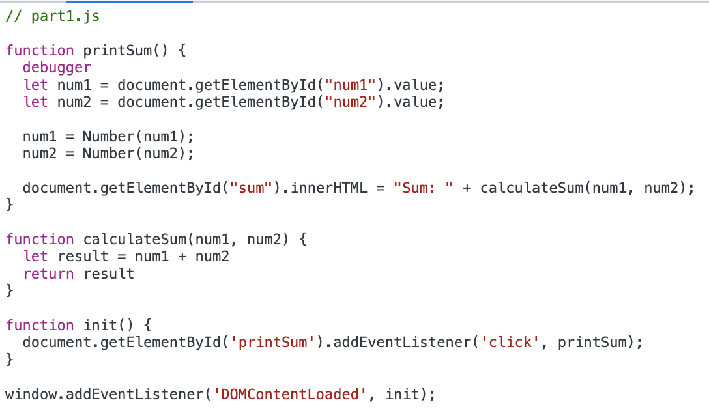

1. The bug was that the num1 and num2 variables initialized in the printSum function are strings, not numbers.
2. I would fix the issue by converting num1 and num2 to numbers in the printSum function of explore.js.
